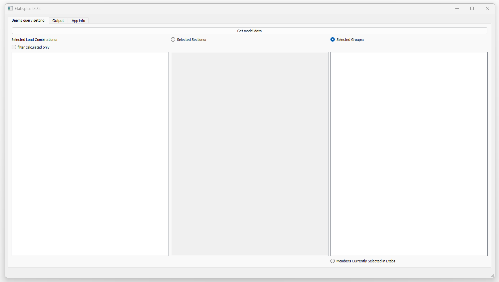

Etabsplus - Etabs member result extract tool
---------------------------------------

`Download binaries for Windows <https://github.com/lukaszlaba/etabsplus/releases>`_

Changelog
---------

Etabsplus 0.0.1 (alpha stage for testing)
  - first public release

Description
-----------

Etabsplus is a tool that help analyse Etabs results. Etabsplus output report help find extreme forces for design.

How to run it
-------------

Windows binaries available. Just download it and run exe file.
Link to windows binaries download is shown below.

https://github.com/lukaszlaba/Etabsplus/releases

You can also run Etabsplus by using Python engine. After the Python and needed libraries are installed, just run Etabsplus.py file. Etabsplus is based on Python 3 and no\n-standard Python libraries - PyQt5, tabulate and comtypes.

License
-------

Copyright (C) 2025 Łukasz Laba <lukaszlaba@gmail.com>

Etabsplus is free software; you can redistribute it and/or modify
it under the terms of the GNU General Public License as published by
the Free Software Foundation; either version 2 of the License, or
(at your option) any later version.

Etabsplus is distributed in the hope that it will be useful,
but WITHOUT ANY WARRANTY; without even the implied warranty of
MERCHANTABILITY or FITNESS FOR A PARTICULAR PURPOSE.  See the
GNU General Public License for more details.